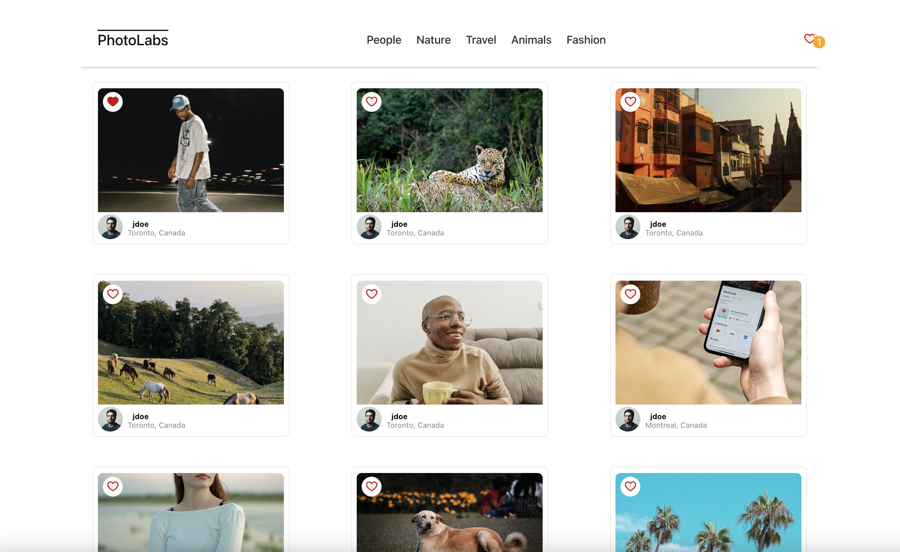
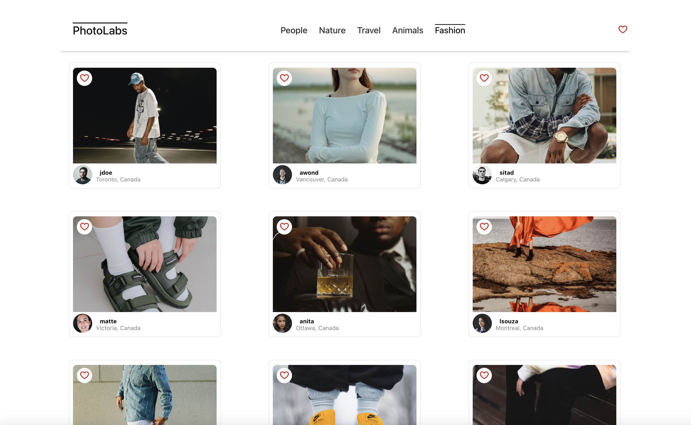

# Photolabs

PhotoLabs is a single-page application (SPA) built with React that allows
users to view and like photos in different contexts.

## Final Product
Home Page


View photos in detail


Switch between categories



## Features
* Users can navigate to different photo categories
* Users can like photos from anywhere within the application where the photo is displayed
* Users can click on a photo to view a larger photo and relevant / similar photos
* Users can view a notification when they have liked photos

## Setup
Install dependencies with `npm install` in each respective `/frontend` and `/backend`.

## [Frontend] Running Webpack Development Server

```sh
cd frontend
npm start
```

## [Backend] Running Backend Servier

Read `backend/readme` for further setup details.

```sh
cd backend
npm start
```

## Dependencies
* React
* Express
* Babble
* Node.js
* SASS